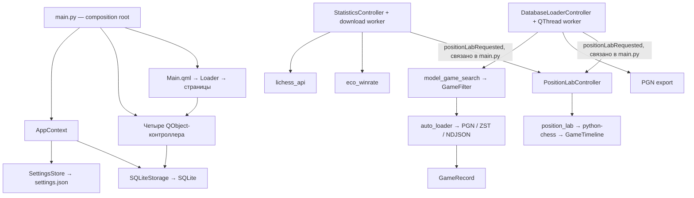
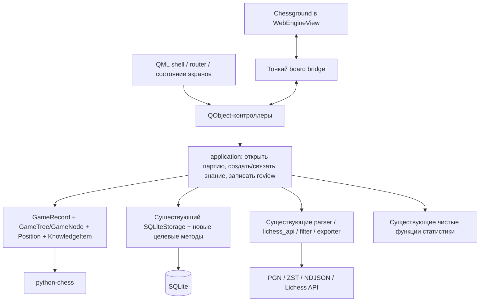

# A. Architecture Map

Уточнение после обратной связи 28.09.2026: существующая архитектура — объект обследования, **не ограничение новой реализации**. Ни имена классов, ни структура каталогов, ни SQLite-схема не обязательны для v2. Допустима новая минимальная основа; решение принимается по сложности нужной вертикали, ясности границ и стоимости сохранения пользовательских данных. Предложения «сохранить/извлечь» ниже — варианты повторного использования, не требования.

## Что есть сейчас

Показанные связи контроллеров проходят через сигналы, соединённые в `main.py`; прямого импорта одной QML-страницы другой нет. Проблема не в самом Qt Signal, а в payload, привязанном к Position Lab, и в смешении application-операций с представлением.

| Компонент | Фактическая роль | Кандидат на переиспользование / изменение |
|---|---|---|
| `main.py`, `app/app_context.py` | Создание storage и четырёх контроллеров, wiring сигналов | Сохранить composition root; зависимости собирать здесь |
| `app/config.py` | Dataclass настроек, JSON-файл | Сохранить; добавлять поля по мере появления источника/движка |
| `backend/entities.py: GameRecord` | Общий DTO партии, headers, moves, raw PGN, source | Оценить расширение либо заменить общей Game-моделью с адаптером импорта |
| `backend/parsers/*` | PGN, ZST, NDJSON → GameRecord | Сохранить ZST и быстрый отбор по headers; дерево строить только для открытой партии |
| `backend/filters/game_filters.py` | Сторона, результат, рейтинг обоих игроков, разница рейтингов, ECO, дебют, префикс ходов, контроль, таймауты | Сохранить семантику и тесты |
| `backend/search/model_game_search.py` | Последовательный отбор, start index, stop, FEN-search | Сохранить, не объявлять семантическим поиском модельных партий |
| `backend/search/opening_catalog.py` | Каталог семейств и вариантов, выбор дебюта с доски | Переиспользовать в Databases |
| `backend/exporters/*` | Экспорт PGN/CSV | Сохранить |
| `backend/statistics/eco_winrate.py` | Активная ECO-статистика; winrate = wins / games | Сохранить формулу и drill-down |
| `opening_stats`, `user_diagnostics`, `pain_index` | Более старые агрегаты, используемые в неактивных сценариях/тестах | Сохранить; не выдавать PainIndex за распознавание шахматных ошибок |
| `backend/position_lab.py` | python-chess, главная линия, FEN, нормализация разметки, UI-словари | Извлекать доменную логику дерева отдельно от UI-проекций |
| `backend/storage/sqlite_storage.py` | Партии, позиции, reviews, legacy cards, дедупликация, SQL и форматирование строк | Сравнить расширение с новой схемой и переносом данных; старый фасад необязателен |
| `controllers/position_lab_controller.py` | Игры + коллекция + повторение + SQL orchestration + состояние доски | Переносить по одной операции в application-слой |
| `ui/qml/Theme.qml`, `components/*` | Общие цвета и часть controls | Новые light/dark темы Lichess; старые controls использовать только при точном соответствии |
| `ui/qml/components/ChessBoard.qml` | Самописная QML-доска, SVG-фигуры, стрелки и выделения | Сохранить до проверки Chessground в Qt; затем заменить только виджет доски |
| `modules/*/manifest.json` | Сохранённые описания вкладок | Текущий запуск их не читает; не строить plugin framework |

## Хранение и реальные ограничения

`data/settings.json` задаёт путь SQLite; относительные пути разрешаются от корня проекта. `AppContext` вызывает `initialize()` при запуске. Активная библиотека — **`position_lab_games`**, а не старая `games`. `upsert_games/list_games` уже являются совместимыми точками входа к новой библиотеке; `storage_meta` содержит маркер однократного переноса legacy.

| Таблица | Использование сегодня | План |
|---|---|---|
| `games` | Старые данные, однократный перенос | Оставить до отдельной проверенной миграции, не переименовывать вслепую |
| `position_lab_games` | Общая библиотека; fingerprint UNIQUE, raw PGN и headers | Сохранить ID и таблицу в первой вертикали |
| `saved_positions` | FEN + один `game_ref` + `ply` + текст/разметка/теги | Перевести в Knowledge с таблицей соответствия ID |
| `position_reviews` | История forgot / partial / remembered | Перенести с сохранением оценки и timestamp |
| `training_cards` | Независимые старые карточки, экран выключен | Сохранить данные; позже преобразовать в знания и аспекты повторения |
| `storage_meta` | Маркер legacy-миграции | Использовать для версий последующих миграций |

Сейчас `foreign_keys=ON`, `busy_timeout=5000`; SQL параметризован, соединения закрываются. Это полезная основа, ORM не нужен.

## Что действительно мешает v2

1. **Идентичность позиции.** `GameTimeline` хранит только mainline, `saved_positions` ссылается на `ply`. В двух вариантах одинаковый ply означает разные узлы; одна позиция может встретиться несколько раз. Нужен постоянный `node_id`, а FEN должен оставаться значением позиции.
2. **Связи знаний.** Один `game_ref` не позволяет одному знанию иметь несколько примеров. Название saved position генерируется из игроков/ECO, отдельного заголовка знания нет.
3. **Происхождение и назначение смешаны.** `source_kind` содержит `lichess`, `statistics_pgn`, `zst`, `legacy`, `external_pgn`; при merge выигрывает приоритетный источник. Одна партия, пришедшая через API и дамп, теряет одну из provenance-записей. «Моя партия» должна определяться участием пользователя, а не экраном импорта.
4. **Контроллеры исполняют use cases.** В Position Lab 711 строк; `openSession` фильтрует и пишет в storage, `saveCurrentPosition` собирает доменные данные, `rateAnswer` управляет review. DatabaseLoader — 795 строк, включая python-chess и worker orchestration. Выделять эти операции нужно ради повторного использования, а не размера файла самого по себе.
5. **Дублирование сценариев.** Импорт/фильтр моих партий есть в активном Statistics и старом MyGames; одинаковые UI-сценарии не должны снова получить отдельную реализацию.
6. **PGN читает файл целиком.** `iter_pgn_file` вызывает `read_text` через `iter_pgn_texts_file`, несмотря на имя `iter`. Внешний PGN и запись SQLite выполняются синхронно в некоторых GUI-слотах. При подключении Master это следует исправить локально, не менять уже потоковый ZST.
7. **Импорт и анализ не разделены по владению.** Upsert выбирает более длинный raw PGN/moves. Когда появятся пользовательские варианты, повторный импорт не должен заменять их. Нужны оригинал импорта и отдельно редактируемое дерево анализа.
8. **UI-state и оформление.** `Loader` пересоздаёт страницу, часть состояния живёт только в QML. Theme уже централизует цвета, но spacing/radii/type и цвета разметки разбросаны. PositionLabPage — 1522 строки; делить на элементы по мере выделения сценариев.

Отдельный риск существующей дедупликации: `game_fingerprint` приводит внешний Lichess ID к `casefold()`. Проверка на двух синтетических ID `AbCdEf12` и `aBcDeF12` даёт один fingerprint. Регистрозависимый внешний идентификатор нельзя нормализовать как username. До расширения импорта исправить это отдельным изменением с проверкой совместимости уже сохранённых fingerprint; не пересчитывать ключи рабочей базы в рамках дизайна.

Дополнительно: requirements используют нижние границы версий без воспроизводимого snapshot; смена SQLite-пути фактически требует перезапуска. Это локальные задачи сопровождения, не основания для инфраструктурного переписывания.

## Минимальная целевая схема

Схема ниже показывает вариант постепенного извлечения. Равноправный вариант — новая небольшая composition root, общие Game/Knowledge и application-операции с импортом legacy-данных. Не создавать совместимые обёртки, если они усложняют реализацию больше, чем перенос. До изменения основы сопоставить оба пути на одном сценарии «партия → узел → знание» и выбрать более простой.

Стрелки — зависимости кода/вызовов. Domain не импортирует SQLite, Qt или контроллеры; storage реализует сохранение доменных значений. Application вызывает конкретный storage, без обязательного интерфейса и DI-контейнера. SQLite не является зависимостью доменной модели.

### Первые извлечения при реализации

- `backend/game_tree.py`: дерево и правила ходов на python-chess, используется анализом и последующим Calculation Training.
- `application/analysis.py`: загрузить игру/дерево, выбрать узел, добавить вариант. Состояние текущей сессии живёт в Python, QML владеет только раскрытием панелей и фокусом.
- `application/knowledge.py`: создать знание из узла, привязать существующее, получить связанные знания; сохранение item + link атомарно.
- `application/review.py`: существующее «показать / оценить» над Knowledge, без нового SRS.
- Общий импорт в application выделяется, когда Settings/My Games начинают вызывать его наряду со Statistics. Workers остаются Qt-адаптерами; use cases не зависят от QObject.

Это границы и кандидаты на файлы, не список заготовок, которые нужно создать заранее. Не добавлять абстрактные репозитории, event bus, CQRS, универсальный job scheduler, отдельные базы на каждую страницу.

### Переходы

`Statistics → OpenGames(game_ids, filter_context)`, `Databases → OpenSelection(games, provenance)`, `Analysis → OpenKnowledge(id)` — команды, обрабатываемые composition root/router. Внешняя выборка сначала сохраняется общей application-операцией, затем передаются ID. Ни одна страница не вызывает другую и не знает её QML-путь. Router хранит route + параметры; Qt Signals остаются достаточным транспортом.

### Personal Corpus

RAW PGN/ZST остаётся внешним неизменяемым источником. В app SQLite попадает нужная выборка с provenance; все узлы массового дампа заранее не материализуются. Позднее preprocessing создаст Personal Corpus, затем перестраиваемый Hot Index с ключами источника/партии/позиции. Знания и пользовательские annotations не хранятся только в этом индексе. Поиск по широкому RAW/мастерскому корпусу остаётся отдельной областью поиска; ограничение репертуаром не вшивается в Knowledge.
