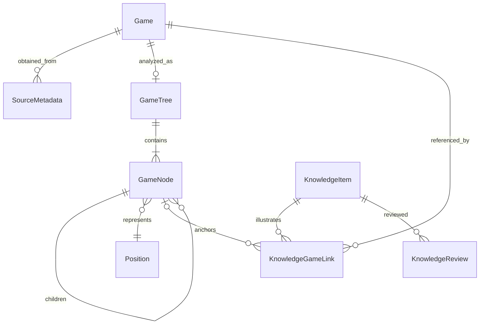

# B. Domain Model v1

Это предложение модели первой вертикали, а не уже применённая схема SQLite. `GameRecord` — существующее представление, которое можно развивать или заменить новой общей `Game`. Новые `MyGame`, `MasterGame`, `LichessCorpusGame` как отдельные классы не нужны. После уточнения пользователя 28.09.2026 привязка к текущим таблицам/ID — лишь вариант миграции; новая основа и явное отображение старых ID в новые допустимы.

`Position` здесь value object; диаграмма не требует таблицы всех FEN. `GameTree` — одно редактируемое дерево на локальную партию, а не новая универсальная сущность Study/Chapter. Оно создаётся лениво при анализе/сохранении привязки.

## Сущности и ответственность

| Сущность | Минимальные поля | Инварианты |
|---|---|---|
| `Game` / `GameRecord` | Существующий `storage_id`; external id, headers, original raw PGN; `variant`, `initial_fen`, provenance | SQLite ID — локальная идентичность; внешний ID всегда имеет namespace. Одно представление для всех источников |
| `SourceMetadata` | `game_id`, `kind`, `locator`, `external_id?`, `imported_at` | Несколько provenance на одну партию. kind: `lichess_api`, `lichess_dump`, `master_pgn`, `local_pgn`, `authored`, `legacy_unknown` |
| `Position` | `fen` из шести полей, `variant` | Не содержит `game_id`; одинаковая позиция может принадлежать разным узлам. Halfmove/fullmove и история не восстанавливаются из расстановки фигур |
| `GameTree` | `game_id`, `root_node_id`, `revision` | Одна редактируемая линия с вариантами. original raw PGN сохраняется отдельно; повторный импорт не заменяет дерево |
| `GameNode` | Постоянный `id`, `game_id`, `parent_id?`, `order`, `move_uci?`, `fen`, `comment`, `nags`, `shapes` | Один корень; root не имеет хода. Parent в той же игре, без циклов; дочерний ход легален. SAN/ply вычисляются из пути |
| `KnowledgeItem` | `id`, `title`, `body`, `origin`, `position?`, `pgn?`, `shapes`, `categories`, `tags`, `source_note`, timestamps | Самостоятельное знание. Origin — `theory` или `self_study`, не источник файла. `title` не выводится только из фамилий/ECO |
| `KnowledgeGameLink` | `id`, `knowledge_id`, `game_id`, `node_id?`, `role`, `note` | NULL node означает связь с целой партией; заданный node должен принадлежать game. Несколько связей с разными узлами одной партии разрешены |
| `KnowledgeReview` | `id`, `knowledge_id`, `rating`, `reviewed_at` | Существующие forgot / partial / remembered. Review относится к знанию; нет второй независимой базы карточек |

### Game и источники

При постепенном переносе можно использовать существующий `position_lab_games.id`; при новой основе — новые ID с явным отображением legacy ID. Имя таблицы и класс не обязательны. Fingerprint служит только дедупликации и **не** становится публичным ID знания/ссылки; его текущая реализация также может быть заменена.

Provenance отвечает «откуда получено». Принадлежность «моя партия» определяется сопоставлением игрока с настроенным username (позднее — явно сохранённой принадлежностью при других аккаунтах). Мастерская партия определяется выбранным при импорте источником, а не порогом Elo. Роль «модельный пример» появляется в `KnowledgeGameLink`, её нельзя автоматически выводить из источника.

Пример: партия из Lichess API и ZST — одна Game, две SourceMetadata. Если в ней играет пользователь, она отображается среди My Games и может одновременно быть примером нескольких знаний.

Legacy `source_kind` сохраняем при переходе. `lichess → lichess_api`, `statistics_pgn/external_pgn → local_pgn`, `zst → lichess_dump`; `legacy` остаётся `legacy_unknown`. Не угадываем Master или Theory по рейтингу и имени файла. Старый импорт мог потерять provenance — миграция не может его восстановить достоверно.

### Узел, позиция и PGN

- ID узла сохраняется при изменении комментария, добавлении соседнего варианта и смене главной линии. Индекс массива, SAN, FEN и `ply` не являются ID.
- Один и тот же FEN в двух ветках — два узла. Транспозиции можно позднее искать по нормализованному ключу: variant, pieces, side, castling, согласованная en-passant-нормализация. Полный FEN всё равно хранится; ключ не определяет историю повторений и правила 50 ходов.
- Для начальной позиции из PGN учитывать `[SetUp "1"]` и `[FEN "..."]`; путь не всегда начинается с обычной стартовой позиции.
- python-chess — авторитет для легальности, SAN, promotion, рокировки и полного FEN. В v1 UI поддерживает обычные шахматы; импорт неподдержанного variant сохраняет оригинал и сообщает ограничение, не интерпретирует его как standard.
- JSON shapes: `{kind: arrow, from: e2, to: e4, color: green}` или `{kind: circle, square: e4, color: blue}`. Цвет — семантическое имя, RGBA принадлежит Theme.
- Комментарий и shapes узла — анализ партии. Body/shapes Knowledge — объяснение знания. Сохранение знания явно копирует текущую разметку; дальнейшее редактирование одной не меняет другую неожиданно.
- Knowledge `position` и `pgn` не являются двумя независимо редактируемыми источниками истины: при наличии PGN его root FEN должен совпадать с position; проверка в use case. FEN без PGN — допустимое самостоятельное знание, текст без шахматного материала тоже допустим.
- PGN knowledge — собственный материал знания (лекционная позиция, фрагмент или целая иллюстрация), не обязательный Game в библиотеке сыгранных партий. Первое сохранение из позиции создаёт FEN + текст; редактор PGN/вариантов knowledge добавляется следующей итерацией.

### Связи

`role` задаёт смысл примера: `source`, `example`, `counterexample`. «Мой»/«мастерский» выводится из партии и provenance. Привязка на уровне партии и на уровне узла различается явно. После создания Knowledge из позиции связь с исходным узлом появляется в той же транзакции.

Одна партия → несколько знаний; один узел → несколько знаний; одно знание → несколько партий/узлов. `KnowledgeItemLink(from_id, to_id, relation, note)` добавляется при появлении UI ручного связывания знаний; отдельные FK, запрет self-link. **Сейчас таблица не нужна.** Аналогично будущая ReviewCard содержит FK на Knowledge + указание аспекта, а не копию знания.

## Минимальные изменения хранения при реализации

Ниже вариант расширения существующей БД, а не обязательная схема. Для новой основы создаются целевые таблицы и проверенный перенос данных с отображением ID; доменные инварианты и требования сохранности остаются теми же.

1. Оставить `position_lab_games` и legacy-таблицы; добавить provenance без дублирования партий.
2. `game_nodes`: обычные parent-child строки, только для открытых/анализируемых игр. `id` — постоянный PK; `UNIQUE(game_id, id)` и составной FK parent гарантируют принадлежность родителя одной игре. Один root на игру — частичный unique index; отсутствие циклов/легальность — проверки application.
3. `knowledge_items`: текст, origin, FEN/PGN и небольшие JSON-массивы tags/categories/shapes. Не создавать универсальную JSON/EAV-модель всего приложения.
4. `knowledge_game_links`: FK item; `game_id`; nullable `node_id`; составной FK `(game_id, node_id)` на node. Два unique index для links с node и без node: обычный SQLite UNIQUE с NULL не предотвращает одинаковые связи на уровне партии.
5. `knowledge_reviews`: FK item; перенос текущей истории. Не вводить интервальный планировщик.

Допустимо хранить revision дерева на Game; выделять SQL-таблицу `game_trees` только ради имени доменного объекта не требуется. Все новые ограничения и миграции вводятся вместе с тестируемым use case, не этим документом.

### Удаление и повторный импорт

Удаление игры/узла с активными links запрещается через RESTRICT до явного решения пользователя об отвязке. Удаление Knowledge удаляет его links/reviews, но не Games. Для очистки библиотеки предлагается архивирование/скрытие связанных партий. Старое `clear_games` с `SET NULL` не переносить в новый сценарий незаметно.

При повторном импорте сохраняются оригинальные provenance и пользовательское дерево. Исправление оригинальной партии не должно молча перепривязать знания: новый материал проверяется и объединяется отдельно. Экспорт анализа строится из дерева; экспорт оригинала — из сохранённого исходного PGN.

## Перенос существующего Position Lab

До изменения схемы — SQLite backup API, dry run на копии, версия миграции в `storage_meta`, атомарная запись схемы и соответствий. Не копировать только основной файл открытой БД без учёта WAL.

`saved_positions.id → knowledge_id` сохраняется явной таблицей соответствия. Текст, теги, FEN, стрелки/выделения, timestamps и reviews переносятся без потерь. Старый `comment` становится body; автоматически предложенный title можно редактировать. Для существующей ручной коллекции предлагается `self_study` как обозначенный миграционный default, не вывод из source. Неизвестное исходное значение остаётся в migration metadata.

Если есть game_ref, дерево строится из исходной партии, и узел mainline[ply] связывается **только при совпадении сохранённой позиции**. Отсутствующая партия, незаконный PGN или несовпадающий FEN не уничтожают знание: сохраняется самостоятельный snapshot с исходными metadata и диагностикой миграции, link на случайный узел не создаётся.

При повторном запуске не должны дублироваться items, links или reviews. Legacy остаётся доступным для сверки, но после переключения writer используется только новая модель; постоянной двойной записи нет. Восстановление backup после новых записей требует отдельного экспорта новых данных — откат нельзя обещать безусловно.
